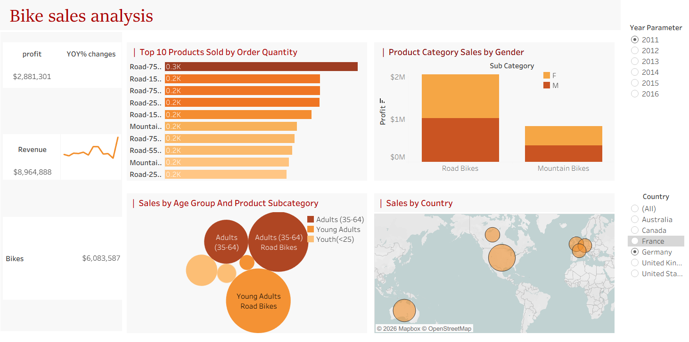

# 🚴 Bike Sales Tableau Dashboard

## Project Overview
This project is an interactive Tableau dashboard built to analyze bike sales data and provide business insights.

## Dashboard Features
- Top 10 Products
- Revenue & Profit Analysis
- Year-over-Year (YOY) Revenue Growth
- Customer Age Group Analysis
- Interactive Year Filter
- Map Visualization

## Tools Used
- Tableau Public
- Microsoft Excel

## Tableau Public Dashboard
https://public.tableau.com/app/profile/shabana.shaika/viz/Bikesales_17830584719100/Bikesalesanalysis

## Dashboard Preview
### Dashboard 1

### Dashboard 2

